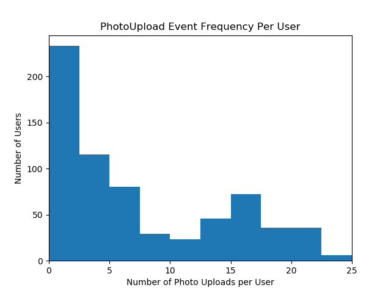

# Analysis of PhotoUpload Event Frequency per User

The PhotoUpload event is one of 4 events within the data, making up approximately 0.085 (5018/58859) of all events generated within the dataset. 0.2704 (676/2500) of all users within the dataset generated a PhotoUpload event at all. I first selected only the PhotoUpload events within the dataset. I then separated out the PhotoUpload events for each user_id and generated the number of PhotoUpload events for each user. I found that on average, a user is generating 7.423 (5018 events /676 users) PhotoUpload events. However, the median number of PhotoUpload events generated was 4, which suggests that the distribution of frequency of PhotoUpload events per user is skewed with a long tail towards the left.

## Visualization of PhotoUpload Event Frequency per User

